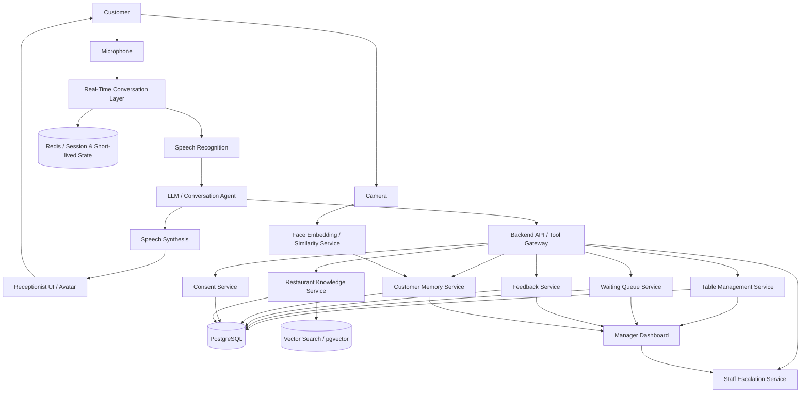
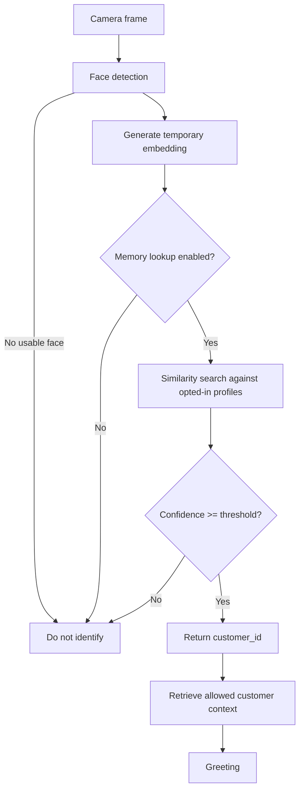

# AI Restaurant Receptionist — System Architecture & Implementation Specification

**Document status:** Canonical architecture specification  
**Purpose:** Source-of-truth specification for an AI coding IDE/agent  
**System type:** Real-time voice AI receptionist for a walk-in restaurant  
**Primary interaction:** Voice conversation  
**Secondary capabilities:** Live table management, waiting queue, restaurant knowledge retrieval, staff assistance, feedback collection, and explicit opt-in returning-customer memory  
**Reservation model:** **NOT SUPPORTED**. The system does not create, modify, or hold future reservations.

---

## 1. Non-Negotiable Product Rules

These rules are authoritative. Any implementation that contradicts them is incorrect.

1. **No future reservations exist in this system.**
2. A customer can be seated only against the **current live table state**.
3. The AI must never invent table availability, wait times, menu facts, policies, customer identities, or operational actions.
4. **The database and deterministic backend services are the source of truth.** The LLM is not the source of truth.
5. Any operational claim made by the AI must come from a successful backend tool/API result.
6. If the backend cannot verify a fact, the AI must say that it cannot confirm it and, when appropriate, escalate to staff.
7. The system must distinguish clearly between **facts**, **estimates**, and **unknowns**.
8. Face recognition/customer memory is **strictly opt-in**. No customer may be enrolled into face memory without explicit consent.
9. The system must not identify an unknown customer merely because a face is visible in a camera feed.
10. If face-match confidence is below the configured threshold, the customer must be treated as unknown.
11. Customers must be able to revoke memory consent and delete their stored face profile.
12. The system must minimize personal data collection and should store a face embedding rather than retaining raw facial images unless there is a separately justified requirement.
13. The receptionist must never claim to have completed an action unless the corresponding tool/API returned success.
14. Tool calls must be validated server-side. Do not trust arguments generated by the model.
15. All business rules that affect seating, queue ordering, table states, consent, and deletion must be enforced by deterministic application code.
16. The AI must hand off to a human when a request is outside its authorized capabilities, when required data is unavailable, or when confidence is insufficient.

---

# 2. Product Definition

The AI Restaurant Receptionist is a digital receptionist that interacts naturally with restaurant guests through speech.

Its core responsibility is to help **walk-in customers** at the restaurant entrance and during the arrival/seating workflow.

It performs five major functions:

1. **Conversation:** Hear the customer, understand intent, and respond naturally.
2. **Operations:** Read and update the live restaurant state through controlled tools.
3. **Knowledge:** Answer restaurant-specific questions using a verified knowledge base.
4. **Optional memory:** Remember returning customers only after explicit opt-in consent.
5. **Feedback:** Collect structured/unstructured customer feedback after the visit.

The AI is an **agent interface over deterministic restaurant services**, not an unrestricted autonomous system.

---

# 3. High-Level Architecture



---

# 4. Responsibility Boundaries

## 4.1 Customer Interface Layer

Responsible for:

- microphone input
- camera input where enabled
- speaker output
- avatar/display UI
- visual state such as listening, thinking, speaking, checking availability, waiting for staff

Not responsible for:

- deciding whether a table is free
- deciding queue order
- deciding whether memory consent exists
- directly writing customer records
- directly writing table state

---

## 4.2 Real-Time Conversation Layer

Responsible for:

- low-latency audio streaming
- turn detection
- interruption/barge-in handling
- speech recognition
- sending conversation context to the agent
- speech synthesis
- session lifecycle

The conversation layer must preserve a server-side session ID.

It must not be the authoritative storage location for restaurant state.

---

## 4.3 LLM / Conversation Agent

Responsible for:

- intent detection
- extracting customer requirements
- choosing the appropriate authorized tool
- deciding when clarification is required
- producing natural language responses
- maintaining conversational context
- explaining verified results

Not responsible for:

- inventing facts
- directly modifying the database
- deciding whether a face belongs to a person
- overriding consent
- changing table state without a tool call
- computing unverified wait-time promises
- creating reservations

---

## 4.4 Backend Tool Gateway

The Tool Gateway is the only controlled interface through which the agent performs operational actions.

Every tool must have:

- strict input schema
- strict output schema
- authorization check
- server-side validation
- logging
- deterministic business logic
- explicit success/failure result

The LLM never receives direct database credentials.

---

# 5. Core Services

## 5.1 Table Management Service

### Purpose

Maintain the current state of every restaurant table.

### Allowed states

```text
AVAILABLE
OCCUPIED
ORDERING
DINING
BILL_REQUESTED
PAYMENT_PENDING
CLEANING
READY
OUT_OF_SERVICE
```

### Important rule

There is **no RESERVED state**.

The system supports walk-in seating only.

### Typical lifecycle

```text
AVAILABLE -> OCCUPIED
OCCUPIED -> ORDERING
ORDERING -> DINING
DINING -> BILL_REQUESTED
BILL_REQUESTED -> PAYMENT_PENDING
PAYMENT_PENDING -> CLEANING
CLEANING -> READY
READY -> AVAILABLE
```

`OUT_OF_SERVICE` can transition back to `AVAILABLE` only through authorized staff action.

### Example table record

```json
{
  "id": 15,
  "table_number": 15,
  "capacity": 4,
  "zone": "main_hall",
  "status": "AVAILABLE",
  "current_visit_id": null,
  "last_state_change_at": "2026-09-08T18:30:00+05:30"
}
```

---

## 5.2 Seating Service

The Seating Service decides whether the current restaurant state permits immediate seating.

Input:

```json
{
  "party_size": 4,
  "requested_zone": "any"
}
```

Output:

```json
{
  "available": true,
  "table_id": 15,
  "table_number": 15,
  "capacity": 4,
  "status": "AVAILABLE"
}
```

If no table is available:

```json
{
  "available": false,
  "reason": "NO_SUITABLE_TABLE",
  "estimated_wait_minutes": 18,
  "estimate_confidence": "medium"
}
```

### Estimate rules

Wait time must be calculated by deterministic backend logic using live data and configured estimation rules.

The LLM must never invent the number.

The UI/AI must label it as an estimate, not a guarantee.

Example:

> “The current estimated wait is about 15–20 minutes.”

Never:

> “Your table will definitely be ready in 17 minutes.”

---

# 6. Waiting Queue

## 6.1 Purpose

Track customers who are currently waiting for a suitable table.

This is **not a reservation system**.

A waiting-list entry is only a record of a customer's current wait at the restaurant.

### Queue record

```json
{
  "id": 1024,
  "customer_id": null,
  "party_size": 5,
  "requested_zone": "any",
  "status": "WAITING",
  "joined_at": "2026-09-08T19:42:00+05:30",
  "estimated_wait_minutes": 20
}
```

Possible queue statuses:

```text
WAITING
CALLED
SEATED
LEFT
CANCELLED
```

Queue ordering should be deterministic. Default policy:

1. Suitable table availability
2. FIFO among compatible waiting parties
3. Explicit staff override when required

The exact queue policy can be configured by the restaurant.

---

# 7. Restaurant Knowledge Base / RAG

## 7.1 Purpose

Answer questions that depend on restaurant-specific information.

Examples:

- opening hours
- closing hours
- menu
- prices
- vegetarian/non-vegetarian options
- allergen information
- accessibility
- high chairs
- parking
- Wi-Fi
- payment methods
- pet policy
- takeaway policy
- dining rules
- birthday arrangements
- facility information

## 7.2 Data flow

```text
Customer Question
      |
      v
Intent / Query Extraction
      |
      v
Knowledge Retrieval
      |
      v
Verified Context
      |
      v
LLM Response
```

## 7.3 Hallucination rule

If retrieval returns no sufficiently relevant verified information, the receptionist must not guess.

Example:

> “I don't have verified information about that at the moment. I can ask a staff member.”

The system may use structured database fields for exact facts and vector search for natural-language retrieval.

---

# 8. Customer Memory System

## 8.1 Purpose

Allow a customer to explicitly ask the receptionist to remember them for future visits.

The feature is optional.

### Memory includes

- customer name
- optional face embedding
- consent status
- consent timestamp
- memory creation timestamp
- last recognized visit timestamp
- optional customer-provided preferences

### Memory does NOT mean

- tracking every person
- identifying everyone entering the restaurant
- automatically creating profiles
- silently storing faces

---

# 9. Face Memory — Exact Workflow

## 9.1 Enrollment

Customer says:

> “Can you remember me next time?”

The system must obtain explicit consent before enrollment.

Recommended dialog:

> “Yes. I can save your name and an optional face profile so I can recognize you on a future visit. Would you like me to save that?”

Customer:

> “Yes.”

The system then:

1. Captures an appropriate face image/frame only for enrollment.
2. Detects a face.
3. Generates a face embedding.
4. Creates or links a customer record.
5. Stores the embedding in the face-memory table.
6. Stores consent metadata.
7. Confirms successful enrollment.

If any step fails, the system must not claim the customer has been enrolled.

---

## 9.2 Returning Visit



## 9.3 Low-confidence behavior

If similarity is below the configured threshold:

- do not identify the person
- do not guess their name
- do not disclose a stored customer identity
- continue as a normal guest

Example:

> “Welcome! How can I help you today?”

not:

> “Are you Rahul?”

unless the product explicitly introduces a separately approved identity-confirmation flow.

---

# 10. Privacy & Consent Rules

The implementation must treat face memory as sensitive personal data and apply privacy-by-design principles.

Minimum controls:

```text
CONSENT_REQUIRED_FOR_FACE_MEMORY = true
MEMORY_ENABLED_DEFAULT = false
RAW_FACE_IMAGE_STORAGE_DEFAULT = false
CUSTOMER_DELETE_MEMORY = true
CUSTOMER_REVOKE_CONSENT = true
AUDIT_CONSENT_EVENTS = true
```

Store only what is required.

Recommended face-memory record:

```text
customer_id
embedding
consent_status
consent_timestamp
revoked_at
created_at
updated_at
```

When consent is revoked:

1. Mark memory disabled.
2. Remove the face embedding from active search.
3. Delete stored biometric data according to the application's retention/deletion policy.
4. Write an audit event without retaining the deleted biometric content.

Never expose embeddings to the LLM.

Never put raw face images or embeddings into normal conversation logs.

---

# 11. Customer Profile

A customer profile should support both anonymous and identified visits.

Example:

```json
{
  "id": 1832,
  "name": "Rahul",
  "phone": null,
  "email": null,
  "memory_enabled": true,
  "created_at": "2026-09-05T19:12:00+05:30",
  "last_visit_at": "2026-09-08T19:16:00+05:30"
}
```

Customer preferences should be stored only when explicitly provided or explicitly saved by the customer.

Example:

```text
preferred_zone = outdoor
usual_party_size = 2
```

Do not infer sensitive attributes from appearance, accent, name, ethnicity, age, gender, or other personal characteristics.

---

# 12. Feedback System

## 12.1 Trigger

After a completed visit, the receptionist may ask:

> “Before you leave, would you like to give us some quick feedback?”

The customer can answer naturally.

Example:

> “The food was excellent, but the service was a little slow.”

The system should extract structured fields where possible:

```json
{
  "food_rating": 5,
  "service_rating": null,
  "wait_experience": "negative",
  "overall_sentiment": "positive",
  "comment": "The food was excellent, but the service was a little slow."
}
```

Do not fabricate numeric ratings when none were actually provided.

It is valid for a field to remain `null`.

---

# 13. Staff Escalation

The system must support human handoff.

Escalate when:

- customer asks for a manager
- customer has a complaint that requires staff intervention
- system lacks verified information
- table state is inconsistent
- backend service is unavailable
- face recognition is uncertain but identity matters
- request requires an operation not supported by the system
- the customer asks for something requiring staff judgment

Example tool result:

```json
{
  "success": false,
  "code": "HUMAN_REQUIRED",
  "message": "Manager assistance required"
}
```

The AI response should be grounded in that result.

---

# 14. Tool / Function Definitions

The following tool contracts are recommended as the initial canonical set.

## 14.1 `get_live_table_state`

Purpose: Read current table states.

Input:

```json
{}
```

Output:

```json
{
  "tables": [
    {
      "table_id": 15,
      "table_number": 15,
      "capacity": 4,
      "status": "AVAILABLE"
    }
  ]
}
```

Read-only.

---

## 14.2 `find_available_table`

Input:

```json
{
  "party_size": 4,
  "zone": "any"
}
```

Output:

```json
{
  "available": true,
  "table_id": 15,
  "table_number": 15,
  "capacity": 4
}
```

---

## 14.3 `seat_customer`

Purpose: Atomically assign a currently suitable table to a current guest.

Input:

```json
{
  "table_id": 15,
  "party_size": 4,
  "session_id": "sess_123"
}
```

Server must re-check table availability before changing state.

Output:

```json
{
  "success": true,
  "table_id": 15,
  "table_number": 15,
  "new_status": "OCCUPIED",
  "visit_id": 9912
}
```

Never trust the earlier availability result alone. The state must be checked again at commit time to avoid race conditions.

---

## 14.4 `estimate_wait_time`

Input:

```json
{
  "party_size": 5,
  "zone": "any"
}
```

Output:

```json
{
  "estimated_wait_minutes": 18,
  "range_minutes": {
    "min": 15,
    "max": 25
  },
  "confidence": "medium",
  "basis": "live_table_state_and_configured_estimation_rules"
}
```

The AI must use the result as an estimate.

---

## 14.5 `add_to_waiting_queue`

Input:

```json
{
  "party_size": 5,
  "session_id": "sess_123",
  "zone": "any"
}
```

Output:

```json
{
  "success": true,
  "queue_entry_id": 1024,
  "queue_position": 2,
  "estimated_wait_minutes": 20
}
```

This is a current waiting-list entry, not a future reservation.

---

## 14.6 `get_restaurant_information`

Input:

```json
{
  "query": "Do you have high chairs?"
}
```

Output:

```json
{
  "found": true,
  "answer_context": "High chairs are available near the family seating area.",
  "source_ids": ["facility_high_chairs_v1"]
}
```

The LLM should answer from `answer_context` and must not add unsupported details.

---

## 14.7 `request_memory_consent`

Purpose: Begin customer-memory consent flow.

This tool should not automatically enroll the customer.

---

## 14.8 `save_customer_memory`

Allowed only after the backend has verified explicit consent.

Input:

```json
{
  "customer_name": "Rahul",
  "session_id": "sess_123",
  "face_embedding": "SERVER_SIDE_REFERENCE"
}
```

Prefer passing an internal server-side reference rather than exposing biometric content to the LLM.

Output:

```json
{
  "success": true,
  "customer_id": 1832,
  "memory_enabled": true
}
```

---

## 14.9 `find_opted_in_customer`

Purpose: Search only active, consented customer face-memory records.

The actual vector/biometric operation must occur server-side.

Output example:

```json
{
  "matched": true,
  "customer_id": 1832,
  "confidence": 0.96
}
```

The similarity threshold must be configured in application settings and tested with representative evaluation data. Do not hard-code a claimed universal accuracy number.

---

## 14.10 `record_feedback`

Input:

```json
{
  "visit_id": 9912,
  "food_rating": 5,
  "service_rating": null,
  "wait_rating": 2,
  "overall_rating": null,
  "comment": "Food was excellent, service was slow."
}
```

Output:

```json
{
  "success": true,
  "feedback_id": 5001
}
```

---

## 14.11 `request_staff_assistance`

Input:

```json
{
  "reason": "customer_complaint",
  "session_id": "sess_123",
  "summary": "Customer reports a service issue and wants a manager."
}
```

Output:

```json
{
  "success": true,
  "ticket_id": "STAFF-5009"
}
```

---

# 15. Conversation State Machine

The conversation agent should model the interaction state explicitly.

```text
GREETING
  -> UNDERSTAND_REQUEST
  -> CLARIFYING (only if required)
  -> CHECKING_SYSTEM
  -> RESPONDING
  -> SEATING / WAITING / INFORMATION / FEEDBACK / MEMORY
  -> COMPLETED
  -> ESCALATED
```

The model may switch conversationally between states, but operational state changes must come from backend results.

---

# 16. Canonical Customer Journey

## Scenario A — Table available

```text
Customer arrives
    ↓
AI greets customer
    ↓
AI asks party size
    ↓
find_available_table(party_size)
    ↓
Available = true
    ↓
AI offers available table
    ↓
Customer accepts
    ↓
seat_customer(table_id)
    ↓
Backend confirms success
    ↓
AI directs customer to table
```

## Scenario B — No table available

```text
Customer arrives
    ↓
AI asks party size
    ↓
find_available_table(party_size)
    ↓
Available = false
    ↓
estimate_wait_time(party_size)
    ↓
AI states estimate
    ↓
Customer agrees to wait
    ↓
add_to_waiting_queue()
    ↓
AI confirms current queue position/estimate
```

## Scenario C — Table becomes ready

```text
Staff changes table state
    ↓
READY / AVAILABLE
    ↓
Queue service searches compatible waiting party
    ↓
Next eligible customer selected
    ↓
AI informs customer
    ↓
Customer accepts
    ↓
seat_customer()
```

## Scenario D — FAQ

```text
Customer asks question
    ↓
get_restaurant_information()
    ↓
Verified context returned
    ↓
AI answers
```

## Scenario E — Unknown FAQ

```text
Customer asks question
    ↓
Knowledge retrieval returns no verified answer
    ↓
AI says it cannot confirm
    ↓
Offer staff assistance when appropriate
```

## Scenario F — Opt-in memory

```text
Customer asks to be remembered
    ↓
Explain memory feature
    ↓
Explicit consent
    ↓
Enroll face + name
    ↓
Store consent + embedding
    ↓
Confirm enrollment
```

## Scenario G — Returning customer

```text
Camera detects face
    ↓
Search only opt-in memory database
    ↓
High-confidence match?
  ├── No → treat as unknown
  └── Yes → retrieve allowed customer name/context
              ↓
           greet customer
```

---

# 17. Daily Example

### 7:15 PM

Customer enters.

AI:

> “Good evening! Welcome. How many people are joining us today?”

Customer:

> “Three.”

AI checks live state.

Backend returns:

```text
Table 3
capacity = 4
status = AVAILABLE
```

AI:

> “We have a table available for three. Please come this way.”

Backend atomically changes the table to `OCCUPIED`.

---

### 7:45 PM

New customer arrives.

Customer:

> “There are five of us.”

No suitable table is currently available.

Backend estimate:

```text
15–20 minutes
confidence = medium
```

AI:

> “We don't have a suitable table available right now. The current estimated wait is around 15 to 20 minutes. Would you like to wait?”

Customer agrees.

They are added to the waiting queue.

---

### 8:03 PM

A table becomes ready.

The queue service selects the next compatible waiting party.

AI:

> “Good news — your table is ready.”

---

### Customer asks a question

> “Do you have high chairs?”

The knowledge service returns verified restaurant information.

AI answers only from the retrieved data.

---

### End of visit

AI:

> “Thank you for visiting us. Would you like to leave some quick feedback?”

Customer:

> “The food was excellent, but the service was a little slow.”

The feedback service stores the verified structured interpretation without inventing a numeric rating that the customer did not provide.

---

### Returning customer

Earlier, the customer had explicitly said:

> “Please remember me next time.”

They consented to face memory.

On a later visit, the face service finds a high-confidence match in the opted-in memory database.

AI:

> “Welcome back, Rahul!”

Customer:

> “Do you remember me?”

AI:

> “Yes. You asked me to remember you during your previous visit.”

Customer:

> “Do you have a table for two?”

AI checks the **current** live table state. It does not look for a reservation because reservations do not exist in this system.

---

# 18. Data Model

Recommended initial PostgreSQL tables:

```text
restaurants
restaurant_hours
restaurant_policies
menu_items
knowledge_documents
restaurant_tables
visits
waiting_queue
customers
customer_face_memory
customer_preferences
feedback
conversation_sessions
conversation_messages
consent_events
audit_events
staff_requests
```

---

## 18.1 `restaurant_tables`

```text
id PK
restaurant_id FK
table_number
capacity
zone
status
current_visit_id NULL
created_at
updated_at
```

---

## 18.2 `visits`

```text
id PK
restaurant_id FK
customer_id NULL
party_size
table_id
arrival_at
seated_at NULL
departed_at NULL
status
created_at
```

Possible visit statuses:

```text
ARRIVED
WAITING
SEATED
COMPLETED
LEFT
```

---

## 18.3 `waiting_queue`

```text
id PK
restaurant_id FK
visit_id FK
party_size
requested_zone
status
queue_position
joined_at
called_at NULL
seated_at NULL
estimated_wait_minutes NULL
```

---

## 18.4 `customers`

```text
id PK
name
phone NULL
email NULL
memory_enabled
created_at
updated_at
last_visit_at NULL
```

Phone/email are optional and should not be required for face-memory functionality unless the product later explicitly introduces that feature.

---

## 18.5 `customer_face_memory`

```text
id PK
customer_id FK UNIQUE
face_embedding VECTOR
consent_status
consent_timestamp
revoked_at NULL
created_at
updated_at
```

Only active consented records may participate in matching.

---

## 18.6 `feedback`

```text
id PK
visit_id FK
food_rating NULL
service_rating NULL
wait_rating NULL
overall_rating NULL
sentiment NULL
comment NULL
created_at
```

---

## 18.7 `consent_events`

```text
id PK
customer_id NULL
session_id
consent_type
action
timestamp
policy_version
```

Examples:

```text
FACE_MEMORY / GRANTED
FACE_MEMORY / REVOKED
FACE_MEMORY / DELETED
```

---

# 19. API Architecture

Recommended stack:

```text
Frontend: React + TypeScript
Backend: Python + FastAPI
Database: PostgreSQL
Vector search: pgvector or equivalent vector database
Cache/session: Redis
Containerization: Docker
CI/CD: GitHub Actions
```

These are implementation choices, not business rules. They can be replaced by equivalent technologies without changing the domain architecture.

---

# 20. Recommended Backend Structure

```text
backend/
├── app/
│   ├── main.py
│   ├── config/
│   │   ├── settings.py
│   │   └── logging.py
│   ├── api/
│   │   ├── routes/
│   │   │   ├── tables.py
│   │   │   ├── queue.py
│   │   │   ├── customers.py
│   │   │   ├── feedback.py
│   │   │   ├── knowledge.py
│   │   │   └── staff.py
│   │   └── websocket.py
│   ├── agents/
│   │   ├── receptionist_agent.py
│   │   ├── prompts.py
│   │   └── schemas.py
│   ├── tools/
│   │   ├── table_tools.py
│   │   ├── queue_tools.py
│   │   ├── knowledge_tools.py
│   │   ├── memory_tools.py
│   │   ├── feedback_tools.py
│   │   └── staff_tools.py
│   ├── services/
│   │   ├── table_service.py
│   │   ├── seating_service.py
│   │   ├── queue_service.py
│   │   ├── knowledge_service.py
│   │   ├── face_memory_service.py
│   │   ├── consent_service.py
│   │   ├── feedback_service.py
│   │   └── escalation_service.py
│   ├── models/
│   ├── repositories/
│   ├── security/
│   └── db/
├── tests/
└── migrations/
```

---

# 21. Recommended Frontend Structure

```text
frontend/
├── src/
│   ├── components/
│   │   ├── ReceptionistAvatar.tsx
│   │   ├── ConversationPanel.tsx
│   │   ├── TableStatus.tsx
│   │   ├── QueueStatus.tsx
│   │   └── ConsentDialog.tsx
│   ├── pages/
│   │   ├── Receptionist.tsx
│   │   └── ManagerDashboard.tsx
│   ├── hooks/
│   ├── services/
│   ├── types/
│   └── state/
└── tests/
```

---

# 22. Manager Dashboard

The manager dashboard should expose the operational state without exposing unnecessary customer data.

Recommended panels:

```text
LIVE TABLE MAP
WAITING QUEUE
ACTIVE VISITS
FEEDBACK SUMMARY
COMMON QUESTIONS
STAFF REQUESTS
MEMORY/CONSENT EVENTS SUMMARY
SYSTEM HEALTH
```

Example live dashboard:

```text
Table 1  OCCUPIED
Table 2  CLEANING
Table 3  AVAILABLE
Table 4  DINING
Table 5  READY

Waiting: 3 groups
Estimated longest wait: 22 min
Staff requests: 1
System status: HEALTHY
```

---

# 23. Anti-Hallucination Architecture

This section is mandatory.

## 23.1 Truth hierarchy

Use this hierarchy whenever sources conflict:

```text
1. Deterministic backend/database state
2. Verified structured restaurant configuration
3. Retrieved restaurant knowledge documents
4. Conversation context supplied by the customer
5. LLM general knowledge
```

For restaurant operational questions, the LLM's general knowledge is never authoritative.

## 23.2 Never fabricate

The AI must never fabricate:

- table numbers
- table availability
- wait times
- prices
- ingredients
- allergy information
- opening hours
- policy details
- customer names
- previous visits
- consent status
- successful tool execution
- staff actions
- system state

## 23.3 Tool result contract

Every tool should return a structured result:

```json
{
  "success": true,
  "data": {},
  "error": null,
  "source": "table_service"
}
```

Failure:

```json
{
  "success": false,
  "data": null,
  "error": {
    "code": "SERVICE_UNAVAILABLE",
    "message": "Table service unavailable"
  },
  "source": "table_service"
}
```

The LLM must respond to the structured result rather than guessing around it.

---

# 24. Concurrency & Race Conditions

Restaurant tables can change while the AI is speaking.

Therefore:

**Do not use:**

```text
check table -> wait -> seat using old result
```

Use:

```text
check table
    ↓
customer accepts
    ↓
atomic server-side seat operation
    ↓
re-check current table state
    ↓
commit if still available
```

If another process took the table first:

```json
{
  "success": false,
  "error": {
    "code": "TABLE_NO_LONGER_AVAILABLE"
  }
}
```

AI response:

> “That table was just taken. Let me check the next available option.”

Then it calls the availability tool again.

---

# 25. Session Management

Each customer interaction must have a `session_id`.

Session context may contain:

```text
session_id
conversation state
current party size
current queue entry
current visit
current customer_id (if safely known)
consent workflow state
last tool results
```

Do not rely on conversation history alone for critical state.

Persist authoritative state in backend/database services.

---

# 26. Authentication & Authorization

At minimum:

```text
CUSTOMER / PUBLIC SESSION
STAFF
MANAGER
ADMIN
```

Customer-facing sessions should not have access to:

- all customer records
- other people's personal data
- face embeddings
- raw feedback database
- staff-only information
- internal system configuration

Staff/manager operations must use authenticated APIs.

---

# 27. Observability

Log operational events in structured form.

Recommended fields:

```text
request_id
session_id
service
operation
timestamp
latency_ms
success
error_code
```

Do not log raw biometric data.

Be careful with conversation logging: sensitive information should be redacted or minimized according to the application's privacy policy.

---

# 28. Failure Handling

## Voice service fails

AI cannot hear/respond normally.

UI should show:

> “Voice service temporarily unavailable. Please use the screen or ask a staff member.”

## Database unavailable

Do not claim current availability.

> “I’m unable to verify table availability right now. Please ask a staff member.”

## Knowledge service unavailable

Do not answer from memory as though it were verified.

## Face service unavailable

Continue as an ordinary guest unless the customer explicitly asks for a memory operation that requires the unavailable service.

## Tool timeout

Do not duplicate a potentially successful state-changing request without an idempotency strategy.

---

# 29. Idempotency

State-changing operations should use an idempotency key, especially:

```text
seat_customer
add_to_waiting_queue
save_customer_memory
record_feedback
request_staff_assistance
```

This prevents duplicate database writes caused by network retries or repeated tool execution.

---

# 30. Security Requirements

Minimum requirements:

- secrets stored in environment/secret manager
- no database password in frontend code
- server-side validation for all tool arguments
- authenticated staff endpoints
- rate limiting on public endpoints
- input validation
- output encoding
- audit logs for privileged actions
- encryption in transit
- encryption at rest where supported
- restricted database permissions
- no biometric data in normal application logs

---

# 31. Testing Strategy

The project must have automated tests.

## Unit tests

Test:

- table-state transitions
- party-size matching
- queue ordering
- wait-time calculation
- consent enforcement
- memory deletion
- confidence threshold behavior
- feedback extraction validation

## Integration tests

Test:

```text
AI tool -> backend -> database
```

Examples:

- available table -> successful seat
- table taken during interaction -> retry behavior
- no table -> queue
- queue customer -> table becomes ready
- consent false -> memory enrollment rejected
- consent revoked -> face record excluded

## End-to-end tests

Simulate complete conversations.

Example:

```text
“Table for 4”
-> availability tool
-> available
-> seat
-> confirmation
```

## Hallucination regression tests

Create a fixed set of questions where the knowledge base does not contain an answer.

Expected behavior:

```text
No verified answer
-> no fabricated answer
-> escalate or state inability to verify
```

---

# 32. Evaluation Metrics

Track measurable system quality.

## Voice

```text
speech recognition latency
response latency
interruption handling success
```

## Agent

```text
tool selection accuracy
argument extraction accuracy
tool success rate
unsupported-claim rate
```

## Restaurant operations

```text
table-state consistency
queue-order correctness
seating race-condition failure rate
wait-estimate error
```

## Memory

```text
consent compliance rate
false match rate
false non-match rate
memory deletion success rate
```

## User experience

```text
task completion rate
average interaction duration
human escalation rate
customer feedback score
```

Do not publish made-up metrics. Metrics must come from actual tests or production telemetry.

---

# 33. Environment Configuration

Example `.env` variables:

```text
APP_ENV=development
DATABASE_URL=...
REDIS_URL=...
LLM_PROVIDER=...
LLM_MODEL=...
REALTIME_VOICE_PROVIDER=...
REALTIME_VOICE_MODEL=...
EMBEDDING_PROVIDER=...
VECTOR_DB_URL=...
FACE_MATCH_THRESHOLD=...
FACE_MEMORY_ENABLED=true
RAW_FACE_IMAGE_STORAGE=false
LOG_LEVEL=INFO
```

Do not hard-code provider API keys in source code.

---

# 34. AI System Prompt Rules

The receptionist agent should have instructions equivalent to the following policy:

```text
You are the restaurant's AI receptionist.

Your job is to help current walk-in guests using verified restaurant information and authorized operational tools.

Never invent restaurant facts.
Never invent table availability.
Never invent waiting times.
Never claim an action succeeded unless the corresponding tool returned success.
Never create or imply a future reservation because this system does not support reservations.
Only seat customers using the live table system.
Only state wait times returned by the backend, and describe them as estimates.
Use the restaurant knowledge system for restaurant-specific factual questions.
If verified information is unavailable, say that you cannot confirm it and offer staff assistance when appropriate.

Customer face memory is opt-in only.
Never identify a person from face data unless that person has an active, consented memory profile and the match satisfies the server-side confidence policy.
If confidence is insufficient, treat the customer as unknown.
Never reveal biometric data, face embeddings, or internal identifiers to customers.

Be polite, concise, natural, and helpful.
Ask only the minimum clarification needed to complete the customer's request.
```

The real policy should live in version-controlled prompt/configuration files and be covered by regression tests.

---

# 35. Example Interaction Contract

### Customer: “Do you have a table for four?”

Agent:

```text
Extract party_size = 4
Call find_available_table(4)
```

If tool returns available:

> “Yes, we have a table available for four.”

Then, when customer accepts:

```text
Call seat_customer(table_id)
```

Only after success:

> “Great. Your table is ready — please come this way.”

---

### Customer: “How long will we wait?”

Call:

```text
estimate_wait_time(party_size)
```

If backend returns 15–20 minutes:

> “The current estimated wait is around 15 to 20 minutes.”

Do not say:

> “It will definitely be 17 minutes.”

---

### Customer: “Can you remember me?”

Start consent flow.

Do not call `save_customer_memory` before consent is verified.

---

### Customer: “Do you remember me?”

Only claim recognition if:

```text
active memory exists
AND
server-side match passes configured threshold
AND
identity is available to the session
```

Otherwise:

> “I’m not able to confirm that I remember you. How can I help today?”

---

# 36. What This System Does NOT Do

The first production version does not include:

```text
NO FUTURE RESERVATIONS
NO SILENT FACE ENROLLMENT
NO AUTOMATIC IDENTIFICATION OF ALL VISITORS
NO UNSUPERVISED STAFF ACCESS
NO INVENTED TABLE AVAILABILITY
NO INVENTED WAIT TIME
NO INVENTED MENU/ALLERGEN INFORMATION
NO DIRECT LLM DATABASE ACCESS
NO UNVERIFIED PERSONAL PREFERENCES
```

These exclusions are deliberate.

---

# 37. MVP Scope

Build the project in this order.

## MVP-1 — Voice receptionist

```text
Voice input
Speech recognition
LLM conversation
Speech output
Restaurant FAQ
```

## MVP-2 — Live restaurant operations

```text
PostgreSQL
Table state machine
Live availability
Immediate seating
Waiting queue
Wait estimation
```

## MVP-3 — Feedback

```text
Visit tracking
Feedback collection
Feedback storage
Manager dashboard
```

## MVP-4 — Opt-in memory

```text
Consent flow
Customer profiles
Face embeddings
Similarity search
Returning-customer greeting
Delete/revoke controls
```

## MVP-5 — Production hardening

```text
Auth
RBAC
Idempotency
Observability
Testing
Docker
CI/CD
Cloud deployment
```

---

# 38. Implementation Order for an AI Coding IDE

Use this dependency order:

```text
1. Project skeleton
2. Database models + migrations
3. Table state machine
4. Seating service
5. Waiting queue service
6. Restaurant knowledge service
7. Feedback service
8. Consent service
9. Customer memory service
10. Tool schemas
11. Backend tool gateway
12. Conversation agent
13. Voice integration
14. Camera / face pipeline
15. Receptionist UI
16. Manager dashboard
17. Tests
18. Security hardening
19. Docker
20. CI/CD
```

Do not start with face recognition before the basic restaurant state machine is correct.

---

# 39. Definition of Done

The project is considered functional only when all of the following are true:

- Customer can speak to receptionist.
- Receptionist responds naturally.
- Restaurant-specific factual questions use verified knowledge.
- Current table availability comes from live backend state.
- Customer can be seated immediately when a suitable table is currently free.
- Customer can be added to a waiting queue when no suitable table is free.
- Queue is not treated as a reservation.
- Table state changes are deterministic and auditable.
- Wait times are backend estimates, not LLM guesses.
- Feedback can be collected and stored.
- Customer memory requires explicit opt-in consent.
- Face matching searches only active opted-in profiles.
- Low-confidence face matches do not result in identification.
- Customer can revoke/delete memory.
- LLM cannot directly access the database.
- State-changing operations are validated server-side.
- Failures do not result in false success messages.
- Automated tests cover critical business rules.
- Logs do not contain raw biometric data.

---

# 40. Canonical Project Summary

**AI Restaurant Receptionist** is a real-time voice-first restaurant assistant for walk-in customers.

The system combines:

```text
Real-time voice interaction
+
Restaurant-specific knowledge retrieval
+
Live table state management
+
Immediate walk-in seating
+
Waiting queue
+
Backend wait-time estimation
+
Feedback collection
+
Explicit opt-in customer memory
+
Face embedding similarity search
+
Manager dashboard
+
Security, consent, auditing, and testing
```

The core architectural principle is:

> **The AI handles conversation; deterministic backend services handle truth and operations.**

This principle must remain intact throughout implementation.
